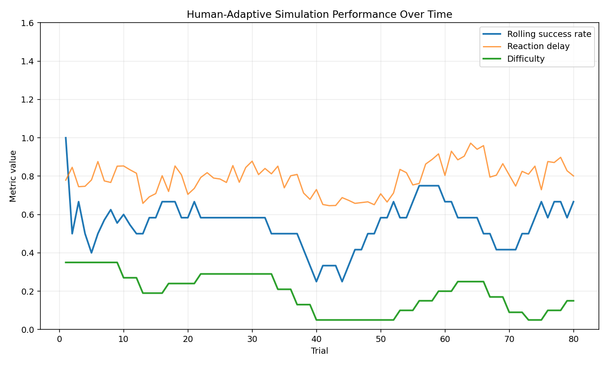
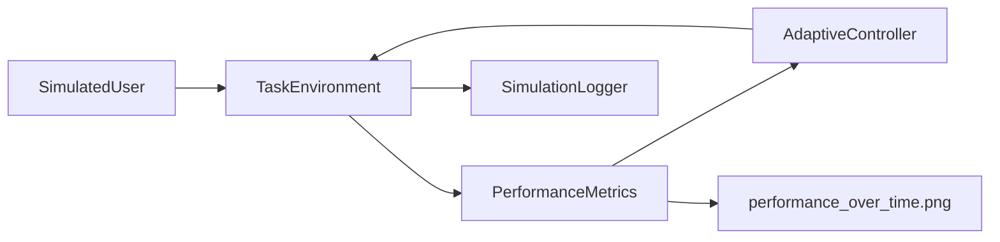

# Human-Adaptive Simulation Environment

A lightweight Python simulation where a task environment adapts to a simulated human user's behavior. The project models success rate, error rate, reaction delay, and consistency, then adjusts difficulty, pacing, and challenge level at runtime.

This is a research-oriented prototype for demonstrating human-adaptive simulation architecture. It does not use real human data; the user is simulated with a small probabilistic model so the adaptation loop can be run locally and inspected easily.

## Relevance to Adaptive RL Systems & Simulation Architecture

Adaptive game and simulation systems often need to respond to human behavior while preserving a clean task loop. This project shows a compact version of that pattern: a user model produces behavior, metrics summarize recent performance, and an adaptive controller reconfigures task parameters.

The structure connects to adaptive environments, task reconfiguration, simulation architecture, reinforcement learning infrastructure, and agent-environment interfaces because the same controller pattern could be used with human-in-the-loop RL experiments, serious games, or behavioral simulation platforms.

## Features

- Simulated human user model with skill, fatigue, and consistency
- Task environment with difficulty, pacing, and challenge level
- Rolling metrics for success rate, error rate, reaction delay, and consistency
- Adaptive controller rules for increasing/decreasing difficulty and pacing
- Runtime logs showing adaptation decisions
- Matplotlib visualization saved to `outputs/performance_over_time.png`
- Basic tests for user behavior and adaptation rules

## Installation

```bash
pip install -r requirements.txt
```

## Usage

Run the simulation:

```bash
python examples/run_simulation.py
```

Run tests:

```bash
python -m pytest
```

The simulation saves a plot to:

```text
outputs/performance_over_time.png
```

It also writes trial-level logs to:

```text
outputs/trial_logs.jsonl
```

Preview:



## Example Adaptation Logic

The controller uses simple, inspectable rules:

| Signal | Adaptation |
| --- | --- |
| High success rate | Increase difficulty |
| High error rate | Decrease difficulty |
| Slow reaction delay | Slow task pacing |
| Stable performance | Introduce a new challenge |

Example log lines:

```text
[adapt] trial=008 action=decrease_difficulty reason=error_rate=0.50 difficulty=0.27 pacing=1.04 challenge=1
[adapt] trial=019 action=increase_difficulty reason=success_rate=0.83 difficulty=0.25 pacing=1.15 challenge=1
```

## Architecture



## Design Notes

The project separates behavior generation, environment state, metrics, and adaptation decisions. This keeps the simulation small while still reflecting the runtime structure of human-adaptive systems.

The rules are intentionally transparent rather than complex. That makes it easier to explain why an adaptation occurred and where a more advanced policy could be added later.

## Future Improvements

- Add configurable adaptation rules through YAML
- Add multiple user profiles with different skill and fatigue patterns
- Compare rule-based adaptation against a learned policy
- Add a Gymnasium-compatible wrapper for agent-based experiments
